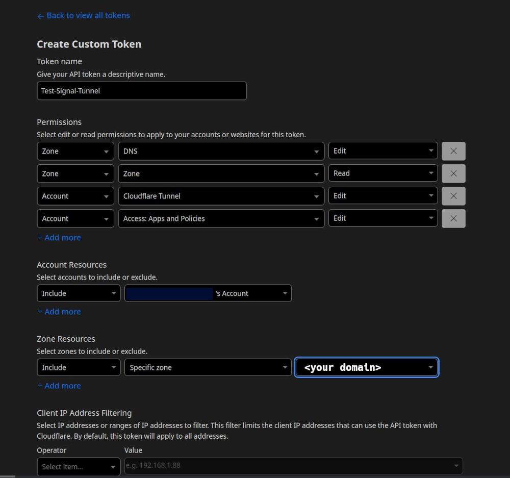
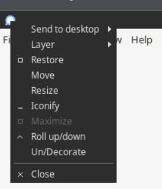

# signal-kasm

## About

This project will set up a Kasm VM and run the Signal desktop app. 

It will then go through Cloudflare and set up a tunnel, an access application, and an access rule to add your email to the allow list.

## Setup

Step 1: Clone this repository

Step 2: Ensure you have `docker.io` and the `docker-compose-plugin` installed

Before proceeding, you will need to go to Cloudflare and set up an API key. 

Click on the profile icon in the top right corner and navigate to:
```
Profile -> API Tokens -> Create Token -> Create Custom Token -> Get Started
```

And then create a token with the following permissions:

```
Zone - DNS - Edit
Zone - Zone - Read
Account - Cloudflare Tunnel - Edit
Account - Access: Apps and Policies - Edit
```

Example:



 
## Configuration

### .env File

Once you have an API key, edit your `.env` file

```
CF_API_TOKEN=<API Token>           # Your Cloudflare API token
CF_ZONE=<domain>                   # The Cloudflare domain you plan to use
CF_HOSTNAME=<hostname | signal>    # The hostname you want to browse (ex. "signal" for signal.example.com)
CF_EMAIL=<email>                   # This is the email where you want to receive the OTP to authenticate
CF_TUNNEL_NAME=<tunnel name>       # Whatever you want to name the tunnel, doesn't really matter
APP_NAME="<application name>"      # What you want to name the access application. Again, doesn't really matter
ACCESS_POLICY_NAME="<policy name>" # Access policy name. Once more, doesn't really matter what you call it

# These are paths inside of the cloudflared docker container - you shouldn't need to change them
CF_FILES_PATH=/etc/cloudflared
CF_TUNNEL_CREDENTIAL_FILE=signal-tunnel.json    # Ideally, this would match CF_TUNNEL_NAME but doesn't need to
CF_CONFIG_FILE=config.yml
```
  
---

### Build the container

Now you will need to build the container:

```
# if you're not already there
cd signal-kasm

docker compose build
```

## Start the containers

```
docker compose up -d
```

## Configure Signal

Browse to your domain. Scan the QR code to sign into Signal.

If you want dark mode, you will need to set that manually in the Signal settings.

If you want Signal to be seamlessly full screen, click on the top left Signal icon and select `Un/Decorate`

  

I also like to choose `Layer -> Always on top` but that's not required.

Congratulations! You now have Signal in the browser!